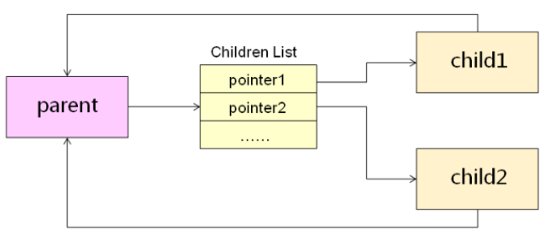

# 第十六课 QT对象间的父子关系

## 一、QT对象间的关系
1. QT对象间可以存在父子关系  
  - 每个对象都有保存它所有子对象的指针  
  - 每个对象都有一个指向其父对象的指针  
    


2. 当指定QT对象的父对象时  
  - 其父对象会在子对象链表中加入该对象的指针  
  - 该对象会保存指向父对象的指针  
```c++  
  int main(int argc, char *argv[])
  {
      QCoreApplication a(argc, argv);

      QObject* p = new QObject();
      QObject* c1 = new QObject();
      QObject* c2 = new QObject();

      c1->setParent(p);
      c2->setParent(p);

      qDebug() << c1;
      qDebug() << c2;

      const QObjectList list = p->children();
      for(int i=0; i<list.length(); i++)
      {
          qDebug() << list[i];//打印的两个分别与c1和c2一样
      }

      qDebug() << c1->parent();
      qDebug() << c2->parent();
      qDebug() << p;//三个打印的值都一样

      return a.exec();
  }
```
  运行结果：  
```
  QObject<0x1f9dcb0>
  QObject<0x1f9dd08>
  QObject<0x1f9dcb0>
  QObject<0x1f9dd08>
  QObject<0x1f9dc58>
  QObject<0x1f9dc58>
  QObject<0x1f9dc58>
```

3. 当对象被销毁时  
  - 将自己从父对象的Children List移除  
  - 将自己的Children List中的所有对象销毁  
  **注：使用QT开发时，不仅要注意内存泄漏，还要时刻关注对象是否可能被多次销毁的问题**  

4. 对象树  
  - 利用Qt对象间的父子关系可以构成对象树  
  - 删除树中的节点时会导致对应的子树被销毁  

```c++
#include <QtCore/QCoreApplication>
#include <QDebug>

class MObj : public QObject
{
    QString m_name;
public:
    MObj(const QString& name)
    {
        m_name = name;

        qDebug() << "Constructor: " << m_name;
    }

    ~MObj()
    {
        qDebug() << "Destructor: " << m_name;
    }
};

void fcTest()
{
    QObject* p = new QObject();
    QObject* c1 = new QObject();
    QObject* c2 = new QObject();

    c1->setParent(p);
    c2->setParent(p);

    qDebug() << "c1: " << c1;
    qDebug() << "c2: " << c2;

    const QObjectList& list = p->children();

    for(int i=0; i<list.length(); i++)
    {
        qDebug() << list[i];
    }

    qDebug() << "p: " << p;

    qDebug() << "c1 parent: " << c1->parent();
    qDebug() << "c2 parent: " << c2->parent();
}

void delTest()
{
    MObj* obj1 = new MObj("obj1");
    MObj* obj2 = new MObj("obj2");
    MObj* obj3 = new MObj("obj3");
    MObj* obj4 = new MObj("obj4");

    obj2->setParent(obj1);
    obj3->setParent(obj1);
    obj4->setParent(obj3);

    delete obj3;

    const QObjectList& list = obj1->children();

    qDebug() << "obj2: " << obj2;

    for(int i=0; i<list.length(); i++)
    {
        qDebug() << list[i];
    }

}

int main(int argc, char *argv[])
{
    QCoreApplication a(argc, argv);

    fcTest();
    delTest();

    return a.exec();
}


```

   


## 二、小结  
  - Qt对象间可以存在父子关系  
  - 通过父子关系能够获得Qt对象树  
  - Qt对象销毁时解除和父对象间的父子关系  
  - Qt对象销毁时将同时销毁所有的子对象  
